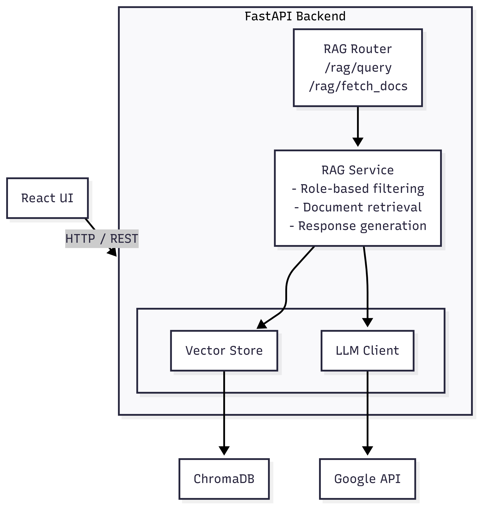

# Role-Based RAG Assistant

A Retrieval-Augmented Generation (RAG) system with role-based access control that provides intelligent, context-aware responses to user queries based on their organizational role.

## 📋 Table of Contents

- [Problem Statement](#problem-statement)
- [Implementation](#implementation)
- [System Design](#system-design)
- [How to Run](#how-to-run)
- [Conclusion](#conclusion)

---

## Problem Statement

### Background: FinSolve AI Company Context

FinSolve is a financial technology company with multiple departments managing sensitive organizational data:

- **Engineering Department**: Technical architecture, microservices, CI/CD pipelines, security models, compliance (GDPR, DPDP, PCI-DSS)
- **Finance Department**: Quarterly financial performance (2024), revenue, income, margins, expenses, cash flow, vendor costs
- **HR Department**: Employee data (100+ records), demographics, compensation, leave tracking, performance metrics, attendance
- **Marketing Department**: Campaign strategies, spend allocations, customer acquisition, ROI benchmarks, conversion metrics
- **General Resources**: Employee handbook with company policies, benefits, conduct codes, workplace standards

### The Challenge

Each department owns highly sensitive documents that must be accessed only by authorized personnel. For example:

- **Finance data** should only be accessible to the Finance Team and C-Level Executives
- **Engineering documentation** restricted to Engineering Team and C-Level Executives  
- **HR employee records** limited to HR & People Analytics team and C-Level Executives
- **Marketing reports** available to Marketing Team and C-Level Executives
- **General policies** (employee handbook) accessible to all employees

Traditional document search systems and standard RAG (Retrieval-Augmented Generation) implementations face critical limitations:

### Key Problems

1. **No Role-Based Access Control**: Most RAG systems retrieve documents based solely on semantic similarity without considering user permissions, creating serious security vulnerabilities

2. **Information Leakage Risk**: A single vector database containing all organizational documents could expose sensitive financial data to marketing staff, or confidential HR records to engineering teams

3. **Compliance & Audit Requirements**: Organizations must demonstrate that sensitive information (financial records, employee data) is accessed only by authorized roles for regulatory compliance (GDPR, PCI-DSS, DPDP)

4. **Context-Aware Retrieval**: Need intelligent retrieval that respects both semantic relevance AND access permissions simultaneously

5. **Hallucination Prevention**: Ensuring AI-generated answers are grounded strictly in retrieved, authorized documents without speculation

### The Solution: Role-Based RAG System

This project implements a **Role-Based RAG Assistant** specifically designed for FinSolve to address these challenges:

#### Core Capabilities

- **Role-Based Access Control (RBAC)**: Documents are tagged with role permissions during ingestion; retrieval enforces these permissions at the vector database level

- **Secure Vector Storage**: ChromaDB with metadata-based filtering ensures users only retrieve documents their role permits

- **Multi-Department Support**: Handles Finance, Marketing, HR, Engineering, and General documents with granular access control

- **Hierarchical Permissions**: Supports role hierarchies (e.g., "God_Tier_Admins" have access to all departments)

- **Context-Aware Responses**: Uses Google Gemini LLM with prompt engineering to generate accurate answers grounded in retrieved context

- **Audit Trail**: Source citations for every response enable compliance verification

- **User-Friendly Interface**: React-based chat UI with role selection, making secure information access intuitive

#### Role Permission Matrix

| Department | Accessible By |
|------------|---------------|
| Finance | Finance_Team, God_Tier_Admins |
| Marketing | Marketing_Team, God_Tier_Admins |
| HR | HR_Team, God_Tier_Admins |
| Engineering | Engineering_Department, God_Tier_Admins |
| General | Employee_Level, Finance_Team, Marketing_Team, HR_Team, Engineering_Department, God_Tier_Admins |

This ensures that sensitive information remains compartmentalized while general company policies are universally accessible.

---

## Implementation

### Tech Stack

#### Backend
- **FastAPI**: High-performance REST API framework
- **ChromaDB**: Vector database for semantic search
- **Sentence Transformers**: Embedding model (`all-MiniLM-L6-v2`) for document vectorization
- **Google Gemini**: LLM for generating context-aware responses
- **Python**: Core programming language

#### Frontend
- **React**: UI framework
- **TypeScript**: Type-safe development
- **Vite**: Fast build tool and dev server
- **Tailwind CSS**: Styling framework
- **Framer Motion**: Animations
- **React Markdown**: Rendering formatted responses

### Core Features

#### 1. **Document Ingestion Pipeline** (`src/ingest.py`)
- Processes documents from different departments (finance, marketing, hr, engineering, general)
- Chunks documents with metadata preservation
- Stores embeddings in ChromaDB with role-based metadata flags
- Role permissions mapping:
  ```python
  {
    "finance": ["Finance_Team", "God_Tier_Admins"],
    "marketing": ["Marketing_Team", "God_Tier_Admins"],
    "hr": ["HR_Team", "God_Tier_Admins"],
    "engineering": ["Engineering_Department", "God_Tier_Admins"],
    "general": ["Employee_Level", "Finance_Team", "Marketing_Team", ...]
  }
  ```

#### 2. **Vector Store** (`app/utils/vector_store.py`)
- ChromaDB persistent client for vector storage
- Sentence Transformer embeddings for semantic search
- Collection-based document organization

#### 3. **RAG Service** (`app/services/rag_service.py`)
- **Role-based retrieval**: Filters documents by user role permissions
- **Document cleaning**: Deduplication and normalization
- **Context building**: Bounded context assembly to stay within token limits
- **Prompt engineering**: Structured prompts to prevent hallucination

#### 4. **API Endpoints** (`app/routers/rag.py`)
- `POST /rag/query`: Main endpoint for role-based Q&A
- `POST /rag/fetch_docs`: Retrieve documents without generating answer
- `GET /health`: Health check endpoint

#### 5. **Frontend Interface** (`ui/`)
- Role selector dropdown
- Chat interface with message history
- Markdown-formatted responses
- Source document display
- Real-time streaming (if configured)

### Data Structure

```
data/
├── engineering/
│   ├── engineering_master_doc.md
│   └── chunked_reports/*.json
├── finance/
│   ├── financial_summary.md
│   └── chunked_reports/*.json
├── marketing/
│   ├── marketing_report_*.md
│   └── chunked_reports/*.json
├── hr/
│   ├── hr_data.csv
│   └── chunked_reports/*.json
└── general/
    ├── employee_handbook.md
    └── chunked_reports/*.json
```

---

## System Design

### Architecture Overview

<p align="center">
  
</p>

The system follows a layered architecture with clear separation of concerns:

- **Frontend Layer**: React-based UI for user interaction and role selection
- **API Layer**: FastAPI router handling HTTP requests and routing
- **Service Layer**: RAG Service implementing business logic and role-based filtering
- **Data Layer**: Vector Store (ChromaDB) for document embeddings and LLM Client (Google Gemini) for response generation

### Data Flow

1. **User Query**
   - User selects role and enters query in UI
   - Frontend sends POST request to `/rag/query`

2. **Document Retrieval**
   - Query is embedded using Sentence Transformers
   - ChromaDB performs vector similarity search
   - Results filtered by role permissions
   - Top-k relevant documents retrieved

3. **Answer Generation**
   - Retrieved documents assembled into context
   - Prompt engineered with context and query
   - Gemini LLM generates response
   - Response formatted as Markdown

4. **Response Delivery**
   - Answer and source documents returned to frontend
   - UI displays formatted response with sources

### Security Model

**Role-Based Access Control (RBAC)**:
- Each document chunk has metadata with `allowed_roles` field
- Vector store queries include role-based filters
- Users can only retrieve documents their role permits
- Multi-role support (e.g., admins have access to all departments)

### Prompt Engineering Strategy

The system uses carefully crafted prompts to:
- Enforce grounding in retrieved context only
- Prevent hallucination and speculation
- Format responses with Markdown structure
- Handle cases where information is unavailable

---

## How to Run

### Prerequisites

- **Python**: 3.10 or higher
- **Node.js**: 18+ and npm
- **Google Gemini API Key**: [Get one here](https://ai.google.dev/)

### Environment Setup

1. **Clone the repository**
   ```bash
   git clone <repository-url>
   cd rag-based-assistant
   ```

2. **Set up environment variables**
   
   Create a `.env` file in the project root:
   ```env
   GEMINI_API_KEY=your_gemini_api_key_here
   ROOT_DATA_DIR=E:\projects\rag-based-assistant\data
   LOG_LEVEL=INFO
   ```

### Backend Setup

1. **Install Python dependencies**
   ```bash
   pip install -r requirements.txt
   ```

2. **Ingest documents into vector store** (First time only)
   ```bash
   python src/ingest.py
   ```
   This will process all documents from the `data/` directory and create embeddings in ChromaDB.

3. **Run the FastAPI server**
   ```bash
   uvicorn app.main:app --reload --host 0.0.0.0 --port 8000
   ```
   
   The API will be available at:
   - API: `http://localhost:8000`
   - Swagger Docs: `http://localhost:8000/docs`
   - Health Check: `http://localhost:8000/health`

### Frontend Setup

1. **Navigate to UI directory**
   ```bash
   cd ui
   ```

2. **Install dependencies**
   ```bash
   npm install
   ```

3. **Run development server**
   ```bash
   npm run dev
   ```
   
   The UI will be available at: `http://localhost:5173`

### Using the Application

1. Open your browser to `http://localhost:5173`
2. Select your role from the dropdown (e.g., Finance Team, Marketing Team, HR Team, etc.)
3. Type your question in the chat input
4. View the AI-generated response with source citations
5. Explore different roles to see how access control works

### API Endpoints

| Method | Endpoint | Description |
|--------|----------|-------------|
| GET | `/` | Root endpoint |
| GET | `/health` | Health check |
| POST | `/rag/query` | Generate answer for query with role-based retrieval |
| POST | `/rag/fetch_docs` | Retrieve documents without generating answer |

**Example Request**:
```json
POST /rag/query
{
  "role": "Finance_Team",
  "query": "What was the revenue for Q4 2024?"
}
```

**Example Response**:
```json
{
  "answer": "According to the Q4 2024 financial report...",
  "sources": [
    "quarterly_financial_report.md",
    "financial_summary.md"
  ]
}
```

---

## Conclusion

This Role-Based RAG Assistant demonstrates how to build a secure, intelligent information retrieval system that respects organizational boundaries and access controls. 

### Key Achievements

- **Secure Information Access**: Role-based filtering ensures users only access authorized documents  
- **Intelligent Retrieval**: Semantic search provides relevant context for user queries  
- **Accurate Responses**: LLM-generated answers grounded in retrieved documents  
- **User-Friendly Interface**: Clean, responsive chat interface with role management  
- **Scalable Architecture**: Modular design supports adding new roles and documents easily  

### Future Enhancements

- **Authentication & Authorization**: Integrate with OAuth/JWT for real user authentication
- **Conversation Memory**: Add chat history and multi-turn conversation support
- **Advanced Analytics**: Track query patterns and user interactions
- **Document Upload**: Allow admins to upload new documents through the UI
- **Multi-Model Support**: Add support for other LLMs (OpenAI, Anthropic, etc.)
- **Caching Layer**: Implement response caching for common queries
- **Fine-tuned Embeddings**: Train domain-specific embedding models
